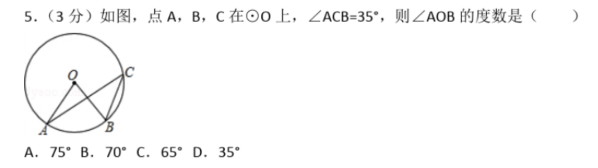
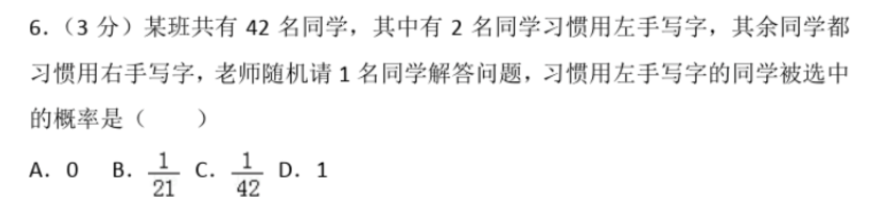

## Test Prompt

### Prompt

`````markdown
## AI Role

You are a **{{grade}} {{subject}} teacher**.

## Input Data

{{inputData}}

## Objective

You need to help students solve the problem presented in the Input Data and explain the key concepts and thought process behind the solution in detail.

## CoT

1. Restate the problem in a more formal way (this step does not need to be displayed in the response);
2. Identify the key mathematical concepts required to solve the problem;
3. Explain if the problem contains any potential challenges or difficulties (skip this part if there are none);
4. Solve the problem step by step with detailed explanations of each stage.

## Additional CoT

1. Open a markdown codeblock;
2. Write your response using Markdown + LaTeX standards.
3. Use `$<math>$` but not `$ <math> $` or `\[<math>\]` for formulas.

## Example format

````
Now, let us solve this problem.

```markdown
## Key Concepts

(Explanation of the mathematical concepts involved)

## Challenges (if any)

(Explanation of the potential difficulties in solving the problem)

## Step-by-step Solution

(Detailed explanation of the solution process, step by step)
```
````
`````

### Test Cases

1. Let `grade` be `high school`;
2. Let `subject` be `math`;

During testing, I used two screenshots as examples for distinct test cases:

1. Case 1: Let `inputData` be:
   

2. Case 2. Let `inputData` be:
   

Data source: [ChinaTextBook](https://github.com/TapXWorld/ChinaTextbook/blob/master/%E5%AD%A6%E6%95%B0%E5%AD%A6%E6%9C%80%E9%87%8D%E8%A6%81%E7%9A%84%E5%88%B7%E4%B9%A0%E9%A2%98%E5%9C%A8%E8%BF%99%E9%87%8C/%E5%88%9D%E4%B8%AD%E7%BB%83%E4%B9%A0%E9%A2%98_%E5%B8%A6%E7%AD%94%E6%A1%88/%E5%88%9D%E4%B8%AD%E6%95%B0%E5%AD%A6%E6%B5%99%E6%B1%9F%E4%B8%AD%E8%80%83%E6%95%B0%E5%AD%A6%E7%9C%9F%E9%A2%98/%E5%88%9D%E4%B8%AD%E6%95%B0%E5%AD%A6%E6%B5%99%E6%B1%9F%E4%B8%AD%E8%80%83%E6%95%B0%E5%AD%A6%E7%9C%9F%E9%A2%98.pdf)


## Key Observations

Getting the AI to produce the correct answer itself is not particularly challenging, at least at the current difficulty level. With the careful design of an appropriate **Chain of Thought (CoT)**, the AI can generate a fairly complete explanation of the solution process.

However, the most difficult aspect of this prompt lies in ensuring the **output formatting**. When the response includes mathematical formulas, the format of the AI's response tends to be quite messy. Therefore, I instructed the AI to format its response within a markdown codeblock. An interesting issue arises here: in the **Additional CoT** section of the prompt, the section title was originally designed as "**Format and Style**". With this wording, the AI's output formatting becomes unstable (in many cases, the AI fails to follow the specified format). However, when this section is called "Additional CoT", the AI consistently produces a more stable output that adheres to the desired formatting across multiple attempts.

The reason why the AI often fails to follow the specified format when the section title is "Format and Style" instead of "Additional CoT" is likely due to the way the AI interprets and prioritizes instructions in the context of the overall prompt. 

The title "Additional CoT" aligns semantically with a structured reasoning process, which reinforces the AI's focus on step-by-step, well-structured output formatting. In contrast, "Format and Style" is more general and may not create the same behavioral cue for the AI, leading to less consistent adherence to formatting guidelines .


## Next Steps

1. Test the AI with more difficult problems.
2. Further tests for output formatting in different prompts, and write a note for the observation.


