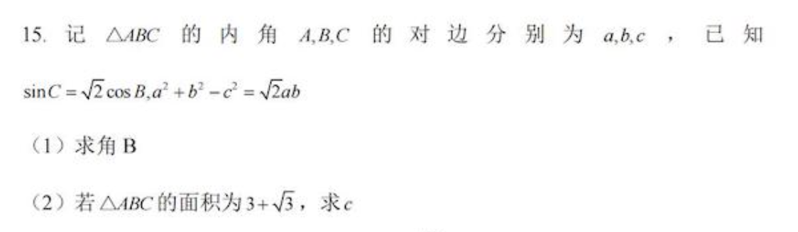

# Experiment 20250311-0

`````markdown
## AI Role

You are a **high school math teacher**.

## Input Data

The pasted image

## Objective

You need to help students solve the problem presented in the Input Data and explain the key concepts and thought process behind the solution in detail.

## CoT

1. Restate the problem in a more formal way;
2. Identify the key mathematical concepts required to solve the problem;
3. Explain if the problem contains any potential challenges or difficulties (skip this part if there are none);
4. Solve the problem step by step with detailed explanations of each stage.

## Additional CoT

1. Open a markdown codeblock;
2. Write your response using Markdown + LaTeX standards (Typora). For example, use `$math$` but not `$ math $` or `\(math\)` for formulas.

## Example format

````
Now, let us solve this problem.

```markdown
## Problem Restatement

(Restated the problem)

## Key Concepts

(Explanation of the mathematical concepts involved)

## Challenges (if any)

(Explanation of the potential difficulties in solving the problem)

## Step-by-step Solution

(Detailed explanation of the solution process, step by step)
```
````
`````

where the pasted image is



After testing several times on both GPT-4o and Claude 3.7, I found that the probability of AI giving incorrect answers is very high. Among them, GPT-4o's error rate is much higher than Claude's. Take the following GPT-4o response as an example:

> ## Problem Restatement
>
> In triangle $\triangle ABC$, the sides opposite angles $A$, $B$, and $C$ are denoted as $a$, $b$, and $c$, respectively. The following conditions are provided: 
>
> 1. $\sin C = \sqrt{2}\cos B$,
> 2. $a^2 + b^2 - c^2 = \sqrt{2}ab$.
>
> We are asked to solve the following:
>
> 1. Find $\angle B$.
> 2. Given that the area of $\triangle ABC$ is $3 + \sqrt{3}$, find the length of the side $c$.
>
> ## Key Concepts
>
> 1. **Trigonometric Relationships in Triangles**: This includes using the sine and cosine functions to understand the relationship between angles and sides. The given $\sin C = \sqrt{2} \cos B$ will help us evaluate the angles.
> 2. **Cosine Rule**: The cosine rule, $c^2 = a^2 + b^2 - 2ab \cos C$, will help relate the given equation to the sides and angles of the triangle.
> 3. **Area of a Triangle**: For a triangle, the area is given by $K = \frac{1}{2}ab\sin C$. This relationship will allow us to find the side $c$.
> 4. **Algebraic Simplification**: Solving for unknowns in terms of the given constraints requires simplification of trigonometric and algebraic expressions.
>
> ## Step-by-step Solution
>
> ### Part (1): Determine $\angle B$
>
> #### Step 1: Express $\sin C = \sqrt{2} \cos B$
> The relationship $\sin C = \sqrt{2}\cos B$ suggests specific values for angles $C$ and $B$. Note that $\sin^2 C + \cos^2 C = 1$ and $\sin^2 B + \cos^2 B = 1$, so both can involve trigonometric identities.
>
> $\cos B = x$ implies $\sin C = \sqrt{2}x$.
>
> #### Step 2: Use the Pythagorean identity for $\sin C$
> Since $\sin^2 C + \cos^2 C = 1$, we substitute $\sin C = \sqrt{2} \cos B$. Therefore:
> $$
> \sin^2 C = (\sqrt{2} \cos B)^2 = 2\cos^2 B, \quad \cos^2 C = 1 - \sin^2 C.
> $$
> This implies:
> $$
> \cos^2 C = 1 - 2\cos^2 B.
> $$
>
> #### Step 3: Analyze potential angle solutions
> The equation $\sin C = \sqrt{2}\cos B$ is satisfied when $\angle C = \frac{\pi}{3}$ (or $60^\circ$) and $\angle B = \frac{\pi}{4}$ (or $45^\circ$). The trigonometric relationships verify this result:
> $$
> \sin \frac{\pi}{3} = \sqrt{3}/2 \quad \text{and} \quad \sqrt{2}\cos \frac{\pi}{4} = \sqrt{2} \cdot \frac{\sqrt{2}}{2} = \sqrt{3}/2,
> $$
> so $\angle B = 45^\circ$.
>
> Thus, $\angle B = 45^\circ$.
>
> ---
>
> ### Part (2): Find $c$ if the area of $\triangle ABC$ is $3 + \sqrt{3}$
>
> #### Step 1: Use the area formula for the triangle
> The area of $\triangle ABC$ is expressed as:
> $$
> K = \frac{1}{2}ab\sin C.
> $$
> Given that $K = 3 + \sqrt{3}$ and $\sin C = \sin 60^\circ = \frac{\sqrt{3}}{2}$, substitute into the area formula:
> $$
> 3 + \sqrt{3} = \frac{1}{2}ab \cdot \frac{\sqrt{3}}{2}.
> $$
> Simplify:
> $$
> 3 + \sqrt{3} = \frac{\sqrt{3}}{4}ab \implies ab = \frac{4(3 + \sqrt{3})}{\sqrt{3}}.
> $$
> Rationalize the denominator:
> $$
> ab = \frac{4(3 + \sqrt{3})\sqrt{3}}{3}.
> $$
>
> #### Step 2: Use the cosine rule to find $c$
> We are given the equation $a^2 + b^2 - c^2 = \sqrt{2}ab$. Substitute for $ab$ as found earlier. The cosine rule for $c^2$ will include $cos C+$.

GPT-4o arbitrarily assumed that B = 45°. This is obviously incorrect.

I'm no w placing this prompt in the "failed" category, because I believe this issue is not caused by my prompt, but rather because the AI itself does not possess reasoning capabilities.

## TO-DO

1. Write an article: **Why AI Makes Errors on Mathematical Problems**


